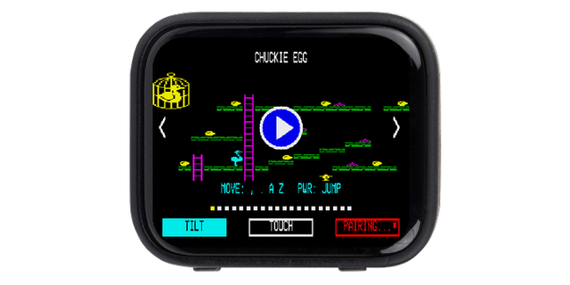
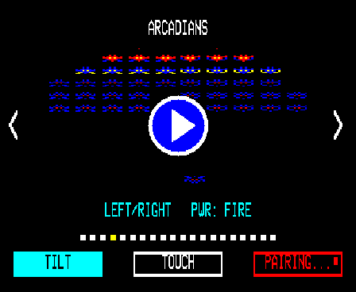
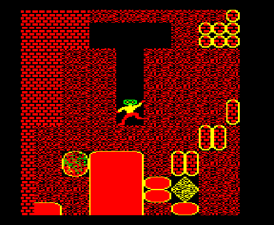
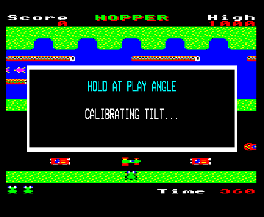
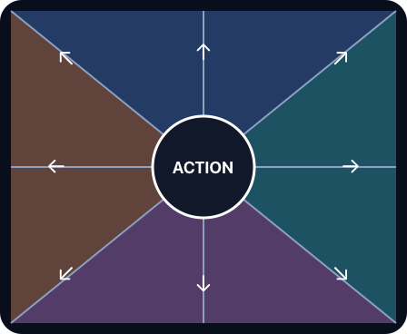
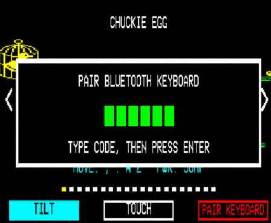
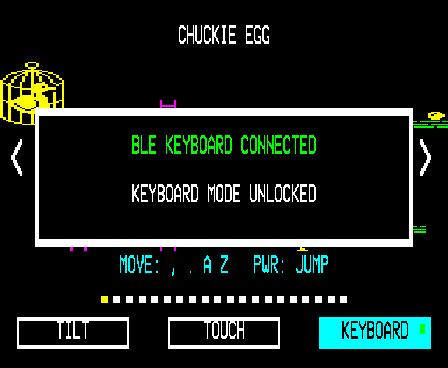
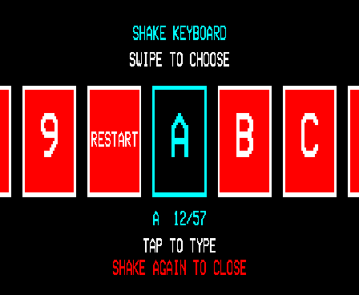

# BeebEm ESP32-S3



A self-contained BBC Micro Model B emulator port for the
[Waveshare ESP32-S3-Touch-AMOLED-1.8 V2](https://www.waveshare.com/esp32-s3-touch-amoled-1.8.htm).
It runs the Linux/SDL BeebEm core directly on the ESP32-S3, presents a centred
4:3 BBC display on the 448×368 AMOLED, drives the onboard speaker, and supports
tilt, eight-way touch, physical buttons, and a BLE keyboard.

## What it looks like

| Game launcher | Gameplay |
| --- | --- |
|  |  |

| Tilt calibration | Eight-way touch |
| --- | --- |
|  |  |

| BLE pairing | BLE connected | Shake key selector |
| --- | --- | --- |
|  |  |  |

The hardware screenshots were captured directly from the ESP32-S3 framebuffer;
the touch-control image remains a diagram so its eight active regions are clear.

## Features

- BBC Micro Model B: 2 MHz 6502, 32 KiB RAM, OS 1.20, BASIC II, DNFS, and 8271 DFS.
- Modes 0–7 in a 640×256 indexed framebuffer, aspect-fitted and centred in a
  448×336 viewport.
- Four-channel SN76489 sound through the onboard ES8311 at 22.05 kHz.
- Per-game key maps, tilt sensitivity, diagonal policy, repeat rate, and two
  physical action buttons.
- A swipeable, one-game-per-screen launcher with Tilt, Touch, or connected
  Keyboard input selection.
- BLE HID keyboard host with BBC matrix mapping, modifiers, function keys,
  cursor keys, BREAK, and a launcher shortcut.
- Writable per-game SSD copies in the 10 MiB wear-levelled flash partition, so
  supported saves and high scores survive ordinary firmware updates.
- About 49 emulated BBC fields/s and 22–24 AMOLED presentations/s on the tested
  V2 board.

## Flash a precompiled image

Use a release only when its notes identify the included assets and their
redistribution permissions. A full image is deliberately paired with the exact
source tag from which it was built.

1. Download the complete v1.3 image from
   [beebem.webassembly.link](https://beebem.webassembly.link/flash/beebem-esp32-s3-v1.3.bin).
2. Connect the board's USB-C data port. Normally no button is needed; if the
   port is absent, hold **BOOT**, tap **RESET**, then release **BOOT**.
3. Install [uv](https://docs.astral.sh/uv/) and list the serial port:

   ```sh
   # macOS
   ls /dev/cu.usbmodem*

   # Linux
   ls /dev/ttyACM*
   ```

4. On macOS, this single block finds the first attached USB modem port,
   downloads the image to a temporary file, flashes it, and cleans up:

   ```sh
   set -eu
   IMAGE=$(mktemp /tmp/beebem-esp32-s3.XXXXXX)
   trap 'rm -f "$IMAGE"' EXIT
   PORT=$(find /dev -maxdepth 1 -name 'cu.usbmodem*' -print | head -n 1)
   test -n "$PORT" || { echo "No ESP32-S3 serial port found" >&2; exit 1; }
   curl --fail --location \
     https://beebem.webassembly.link/flash/beebem-esp32-s3-v1.3.bin --output "$IMAGE"
   uvx --from esptool esptool --chip esp32s3 --port "$PORT" --baud 460800 \
     write-flash 0x0 "$IMAGE"
   ```

5. On Linux, this equivalent block detects the first `/dev/ttyACM*` device:

   ```sh
   set -eu
   IMAGE=$(mktemp /tmp/beebem-esp32-s3.XXXXXX)
   trap 'rm -f "$IMAGE"' EXIT
   PORT=$(find /dev -maxdepth 1 -name 'ttyACM*' -print | head -n 1)
   test -n "$PORT" || { echo "No ESP32-S3 serial port found" >&2; exit 1; }
   curl --fail --location \
     https://beebem.webassembly.link/flash/beebem-esp32-s3-v1.3.bin --output "$IMAGE"
   uvx --from esptool esptool --chip esp32s3 --port "$PORT" --baud 460800 \
     write-flash 0x0 "$IMAGE"
   ```

   If opening the port reports `Permission denied`, add your user to the serial
   device group with `sudo usermod -aG dialout "$USER"`, then log out and back
   in before retrying. Some distributions use `uucp` instead of `dialout`.

The first boot takes a little longer while writable storage is initialized.
The merged image ends before the storage partition, so existing game saves and
high scores are preserved. It does cover NVS, so pair the BLE keyboard again
after a full-image update. An explicit `erase-flash` also removes storage.

## Build from source

Requirements: Git, [uv](https://docs.astral.sh/uv/), CMake/Ninja prerequisites
for ESP-IDF, and legally obtained build assets. All generated dependencies live
under this checkout; no username or fixed installation directory is assumed.

```sh
git clone https://github.com/rhys101/Beebem-ESP32-S3.git
cd Beebem-ESP32-S3

# Clone ESP-IDF 5.5.5, create .venv with uv, and install the S3 toolchain.
scripts/setup.sh

# Fetch and verify local-build assets directly from their archive hosts.
.venv/bin/python tools/fetch_assets.py

# Build, flash, and watch the serial log.
scripts/idf.sh build
scripts/idf.sh -p PORT flash monitor
```

Quit the monitor with `Ctrl+]`. If ESP-IDF is already installed elsewhere, skip
setup and invoke commands with `IDF_PATH=/path/to/esp-idf` and, if needed,
`IDF_TOOLS_PATH=/path/to/tools`. `scripts/idf.sh` resolves everything else from
the repository location.

To make the single binary used for hosted releases:

```sh
scripts/build-release.sh
scripts/flash-release.sh PORT
```

This produces `dist/beebem-esp32-s3-v1.3.bin` plus a SHA-256 file. Both `dist/`
and all installed media are ignored by Git.

For a new checkout, setup + archive fetch + build + flash is one command:

```sh
scripts/build-and-flash.sh PORT
```

## Launcher and controls

Swipe across the game image to browse, or use the Left/Right arrow keys on a
connected BLE keyboard. Tilting does not change the selected game. Tap the
circular Play button, or tap **PWR**, to start. Input selection is accepted only
in the lower third of the launcher, which prevents an accidental change while
swiping. Keyboard is selectable only after a live BLE connection and becomes
the default when one is connected.

### Tilt

Tilt is the default without a keyboard. After Play, hold the board comfortably
at the angle from which you intend to play. The four-second calibration makes
that pose neutral. Movement is relative to it and can hold diagonals such as
up-left. Sensitivity and repeat are tuned independently for each title.

**PWR** is the primary action. **BOOT** is the secondary action; do not hold it
while resetting because that deliberately enters the ESP32 ROM bootloader.

### Touch

The screen outside its centre is divided into eight sectors. Left/right/top/
bottom hold one direction; corner sectors hold two directions together. The
centre is the secondary action and **PWR** remains the primary action. A held
sector stays electrically down, giving normal BBC keyboard repeat.

### Bluetooth keyboard

This is a BLE HID host, not Bluetooth Classic. Put the keyboard into pairing
mode. When a six-digit code appears on the AMOLED, type those digits on the
keyboard and press **Return**. The launcher confirms **BLE KEYBOARD CONNECTED**,
unlocks Keyboard, and selects it by default. This firmware has been tested with
the **Logitech Pebble Keys 2 K380s**. On that keyboard, hold one Easy-Switch key
until its light flashes rapidly before pairing.

Normal characters, Shift/Ctrl, BBC function keys, and cursor keys are mapped to
the BBC matrix. F12 or Pause sends BREAK. The top-right Delete/lock key returns
to the game chooser without dropping the BLE link and silences active sound.

### Built-in key selector

Shake the board during a game to open the horizontal key carousel. Swipe to
browse `0`–`9`, **RESTART**, `A`–`Z`, Space, Return, Escape, Delete, Tab, and
useful punctuation, then tap the centred card to send it. **RESTART** returns to
the graphical chooser, preserves saves, silences sound, and keeps an active BLE
keyboard connection. Shake again to dismiss it without typing.

## Included game profiles

The firmware has profiles for Chuckie Egg, Planetoid, Hopper, Arcadians,
Repton, Thrust, Zalaga, Daredevil Dennis, Frak!, Repton 3, Repton 2, Snapper,
Killer Gorilla, Mr. Ee!, Flappy Bird, Painter, Super Breakout, BBC Tetris,
Citadel, and Elite. Profiles define startup automation and controls; the games
themselves are user-supplied and are not in this repository.

For Killer Gorilla, Touch or a BLE keyboard is recommended instead of Tilt.

## Test

The host harness runs the portable CPU, memory, VIA, video, sound, and 8271 code
under AddressSanitizer. With assets installed:

```sh
cmake -S tests/host -B tests/host/build-asan \
  -DCMAKE_CXX_FLAGS="-fsanitize=address -fno-omit-frame-pointer" \
  -DCMAKE_EXE_LINKER_FLAGS="-fsanitize=address"
cmake --build tests/host/build-asan
ASAN_OPTIONS=detect_leaks=0 tests/host/build-asan/bc32_host \
  components/assets/roms/os12.rom components/assets/roms/basic2.rom \
  components/assets/roms/dnfs.rom components/assets/fonts/teletext.fnt \
  /tmp/chuckie.ppm components/assets/discs/chuckie_egg.ssd
```

See [testing](docs/TESTING.md), [architecture](docs/ARCHITECTURE.md), and
[port provenance](docs/UPSTREAM.md) for more detail. Maintainers can use the
[USB screenshot workflow](docs/SCREENSHOTS.md) to capture real launcher and
game frames for this README.

## Licensing

The BeebEm-derived core retains David Alan Gilbert's original terms, including
the requirement that binaries be accompanied by complete source and the request
to contact the author before using large sections. Those terms are reproduced
in [LICENSES/BeebEm.txt](LICENSES/BeebEm.txt). Original ESP32 port code is MIT
licensed; bundled display and sensor components retain their own licence files.

BBC ROMs, game media, saves, names, and screenshots remain the property of
their respective owners.
